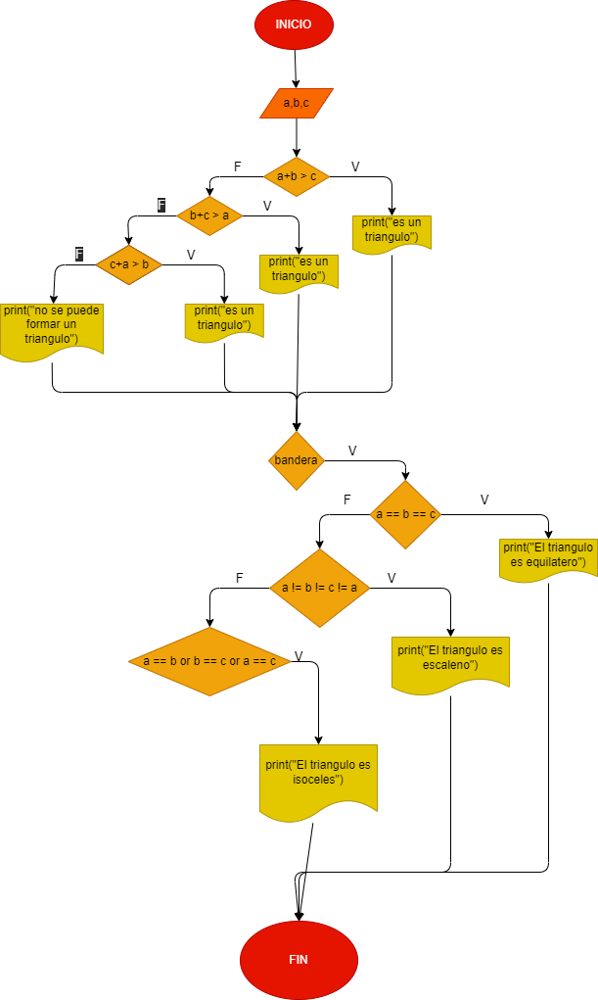

# Determinar si un triangulo es isoceles, escaleno, o equilatero.

# Analisis
Equilatero: todos sus lados son iguales
Isoceles: dos de sus lados son iguales
Escaleno: todos sus lados son diferentes

## Diagrama de flujo

